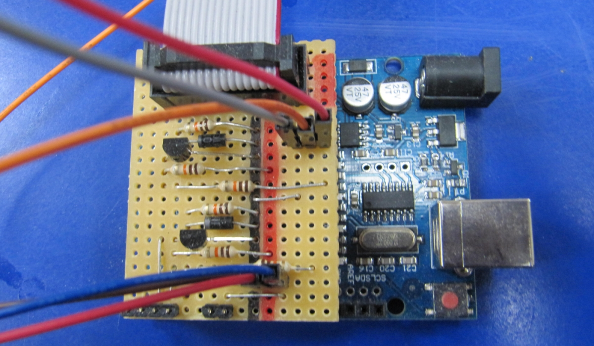

# blazing-baton-eurorack
Visual helper for 16 bars of a 4/4 beat with 16 RGB-LEDs for achieving **better song structure** during live jams.  

  

This is created as a shield for Arduino UNO so there are no TS jacks for CV-clock and CV-reset.  
Clock, Reset & GND are connected to a pin header on the shield. The RGB-LED strip is connected via pinheader as well...  

  

basically the same as https://github.com/othmar52/blazing-baton-arduino with a few changes:  

 - instead of MIDI clock we use CV-clock + CV-reset as input signals
 - dropped RF network server/client communication  
 
 
 
see my other [eurorack DIY projects](https://github.com/othmar52/eurorack)  
